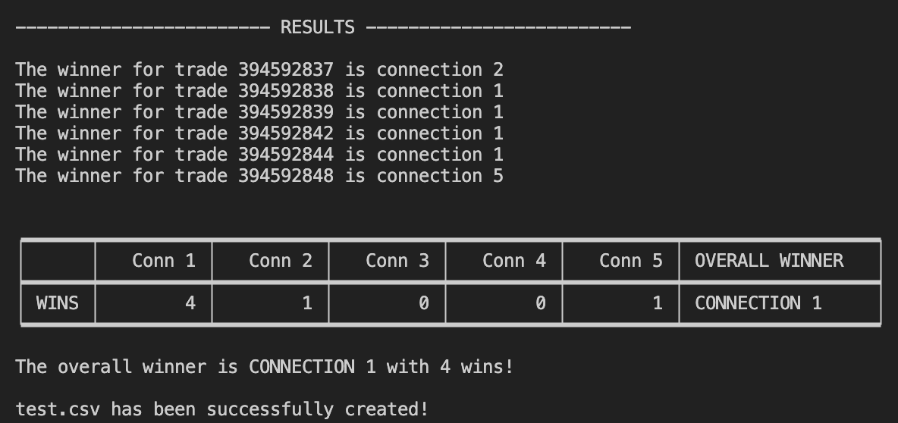
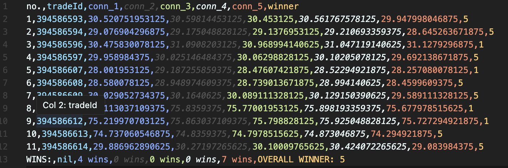

# WS-OKX-SOLUSDT
A backend project that establishes a websocket connection to OKX's server via OKX's TRADES API. This app allows the user to establish multiple parallel websocket connections to OKX's server and measures the latency of the various connections per tradeId. The app will then create a CSV file with the trade data and output the winning connection that came in first the most number of times from all the trades.

Example Tabulate output:

Example CSV result (also see "trades.csv" for GitHub rendition):

